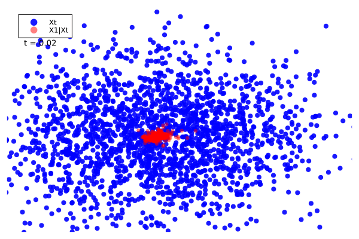
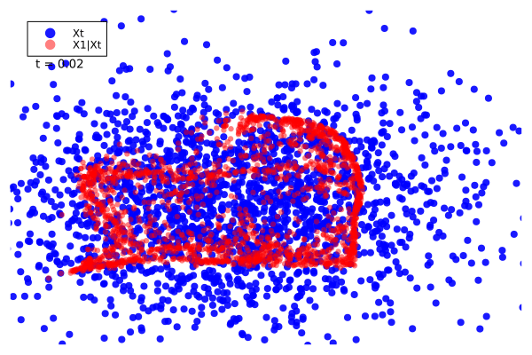
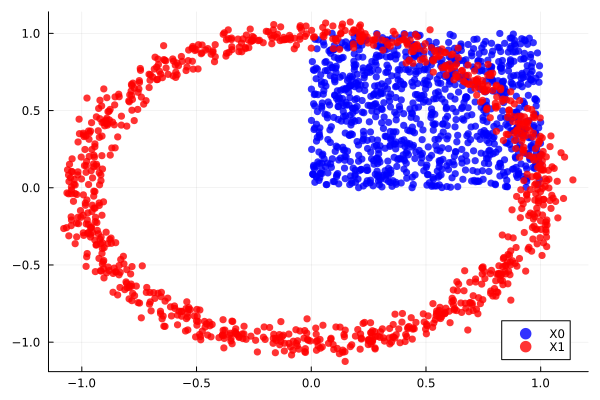
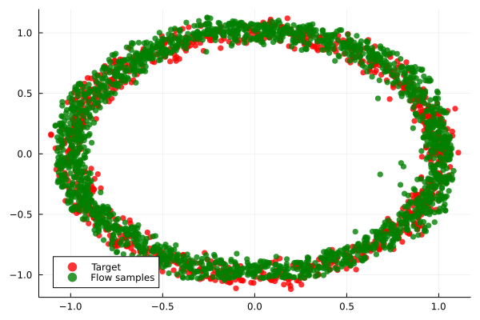

#  ManifoldFlows.jl

[](https://MurrellGroup.github.io/ManifoldFlows.jl/stable/)
[](https://MurrellGroup.github.io/ManifoldFlows.jl/dev/)
[](https://github.com/MurrellGroup/ManifoldFlows.jl/actions/workflows/CI.yml?query=branch%3Amain)
[](https://codecov.io/gh/MurrellGroup/ManifoldFlows.jl)

ManifoldFlows.jl allows you to build [Flow Matching](https://arxiv.org/pdf/2302.00482) models, but where the objects you're modeling [exist on manifolds](https://arxiv.org/abs/2302.03660). ManifoldFlows.jl does not try to be a faithful replication of anything specific, but instead cobbles together a collection of tricks that have (sometimes) worked for us, in our use cases. We currently support Euclidean space, rotations, and the probability simplex, piggybacking off [Manifolds.jl](https://github.com/JuliaManifolds/Manifolds.jl) much of the time.

The basic idea is that you can train a model (typically a deep neural network) to interpolate between a simple distribution (that you can sample from) and a complex distribution (that you only have training examples from).

This is a visualization of a [toy example](https://github.com/MurrellGroup/ManifoldFlows.jl/blob/main/examples/spiral.jl) showing: i) the initial samples ($X_t$, blue) and how they change from their base distribution (a Gaussian) at $t=0$, to the spiral target distribution at $t=1$. Also shown is the model's estimate of the end state ($X_1 | X_t$, red).



The bahaviour differs depending on whether the target and base samples are paired randomly during training, or paired via optimal transport:




## Quick start

### Installation

```julia
using Pkg
Pkg.add(url="https://github.com/MurrellGroup/ManifoldFlows.jl")
Pkg.add(["Plots", "Flux", "CUDA"])
```

### Prelims

```julia
using ManifoldFlows, Plots, Flux, CUDA
#device!(2) #If you have more than one GPU (they're zero indexed)

ENV["GKSwstype"] = "100" #Allow Plots to run headless

#Convenience function for plotting
scatter_points!(points; label = "", color = "black") = scatter!(points[1,:],points[2,:], markerstrokewidth = 0, color = color, alpha = 0.8, label = label)

#Setting up "target" (which would usually be your data) and "zero" distributions (where the points start).
target_sample() = (l -> Float32.(randn(2).*0.05 .+ [sin(l), cos(l)]))(rand()*2*pi)
zero_sample() = rand(Float32,2)

#Plotting the two distributions
pl = plot()
scatter_points!(stack([zero_sample() for i in 1:1000]), label = "X0", color = "blue")
scatter_points!(stack([target_sample() for i in 1:1000]), label = "X1", color = "red")
savefig(pl,"square_circle_problem.svg")
```


### Model setup

```julia
#Setting up a simple NN:
hs = 256
af = leakyrelu
features(x) = vcat(x, sin.(x), cos.(x), sin.(x .* 3), cos.(x .* 3), sin.(x .* 7), cos.(x .* 7)) #Eh...
net = Chain(
    Dense(21,hs,af),
    [SkipConnection(Dense(hs,hs,af), +) for i in 1:4]...,
    Dense(hs,hs,af),Dense(hs,2)) |> gpu #Note: moved to the GPU

#A ManifoldFlows model must take a (t,Xt) pair as input and return X̂1|Xt
model(t,Xt) = net(vcat(features(t),features(Xt)))
    
ps = Flux.params(net) #For Flux to track the parameters

#Optimizer - Note: the WeightDecay param is fun to play with!
opt = Flux.Optimiser(Flux.WeightDecay(1f-5), Flux.AdamW(1f-3))

#Defining the Flow:
f = EuclideanFlow()
```

### Training loop

```julia
batch_size = 4096
for batch in 1:5000
    #Set up the training sample pairs
    x0 = VectorFlowState(stack([zero_sample() for i in 1:batch_size]))
    x1 = VectorFlowState(stack([target_sample() for i in 1:batch_size]))    
    t = rand(Float32, 1, batch_size) #Note: t must be a ROW vector

    xt = interpolate(f,x0,x1,t) #Interpolate between target and zero samples
    x1, t, xt = (x1, t, xt) |> gpu #Move to GPU
    
    # Calculate gradients and update the model
    l,grads = Flux.withgradient(ps) do
        loss(f,model(t,xt.x),x1,t)
    end
    Flux.Optimise.update!(opt, ps, grads)
    mod(batch, 100) == 1 && println("Batch: ", batch, "; Loss:", l)
end
```
```
Batch: 1; Loss:144.97873
Batch: 101; Loss:0.43465137
Batch: 201; Loss:0.32743526
Batch: 301; Loss:0.29340154
Batch: 401; Loss:0.28266412
Batch: 501; Loss:0.27840167
Batch: 601; Loss:0.2654748
Batch: 701; Loss:0.263998
Batch: 801; Loss:0.26312193
Batch: 901; Loss:0.26359686
Batch: 1001; Loss:0.26441458
Batch: 1101; Loss:0.26529795
...
```

### Flow sampling
```julia

#Inference under the trained model, starting from the zero distribution
x0 = VectorFlowState(stack([zero_sample() for i in 1:2000]))
#This is where the "Flow" sampling actually happens.
#Note how the model needs move input from the CPU to GPU, and move output back.
#This is because the flow maths happens CPU-side.
draws = flow(f,x0, (t,Xt) -> cpu(model(gpu(t),gpu(Xt.x))), steps = 50) 

#Plot these against the original target distribution
pl = plot()
scatter_points!(stack([target_sample() for i in 1:1000]), label = "Target", color = "red")
scatter_points!(draws, label = "Flow samples", color = "green")
savefig(pl,"square_circle_flow.svg")
```




### Visualizing the sample paths

```julia
#If you want to track the sample "paths" during sampling, use a Tracker during the flow:
sample_paths = Tracker()
draws = flow(f,x0, (t,Xt) -> cpu(model(gpu(t),gpu(Xt.x))), steps = 50, tracker = sample_paths) #This is where the "Flow" sampling actually happens

#Plotting Flow inference vs the target distribution
xt_stack = stack_tracker(sample_paths, :xt)
x̂1_stack = stack_tracker(sample_paths, :x̂1)
t_stack = stack_tracker(sample_paths, :t)

anim = @animate for i in vcat([1 for _ in 1:5], 1:size(xt_stack, 3), [size(xt_stack, 3) for i in 1:5], size(xt_stack, 3):-1:1)
    scatter(xt_stack[1,:,i], xt_stack[2,:,i], markerstrokewidth = 0.0, axis = ([], false),
    color = "blue", label = "Xt", alpha = 0.9, 
    markersize = 4.5)
    scatter!(x̂1_stack[1,:,i], x̂1_stack[2,:,i], markerstrokewidth = 0.0, axis = ([], false),
    color = "red", label = "X̂1|Xt", xlim = (-1.2,1.2), ylim = (-1.2,1.2), alpha = 0.5, 
    markersize = 3.5, legend = :topleft)
    annotate!(-0.85, 0.75, text("t = $(round(t_stack[i], digits = 2))", :black, :right, 9))
end
gif(anim, "square_circle.gif", fps = 15)
```


