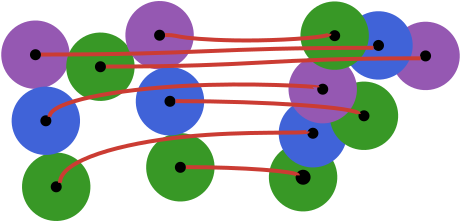
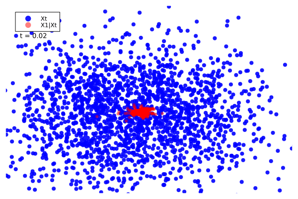

#  ManifoldFlows.jl

ManifoldFlows.jl allows you to build [Flow Matching](https://arxiv.org/pdf/2302.00482) models, but where the objects you're modeling [exist on manifolds](https://arxiv.org/abs/2302.03660). ManifoldFlows.jl does not try to be a faithful replication of anything specific, but instead cobbles together a collection of tricks that have (sometimes) worked for us, in our use cases. We currently support Euclidean space, rotations, and the probability simplex, piggybacking off [Manifolds.jl](https://github.com/JuliaManifolds/Manifolds.jl) much of the time.

